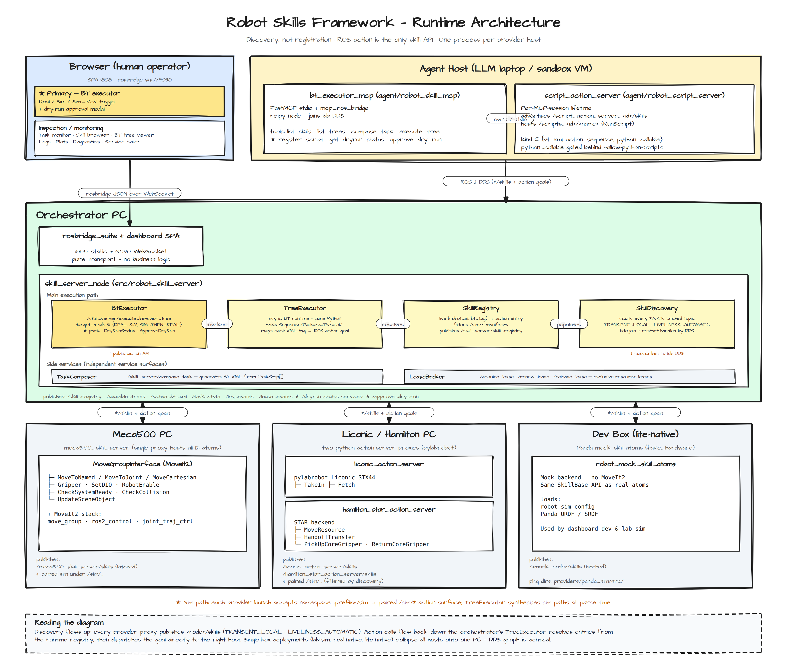

# Robot Skills Framework — ROS 2 Jazzy

A discovery-based robot/instrument orchestration framework. Every skill — hardware-bound (MoveIt2 arm motion, pylabrobot instrument calls) or software-only (LLM-authored scripts) — is exposed as a self-advertising **ROS 2 action**. The orchestrator never hardcodes endpoints; it subscribes to latched `<node>/skills` manifests and dispatches goals over DDS.

Built on **ROS 2 Jazzy** + **MoveIt2** + a Python BehaviorTree.CPP-v4-compatible executor.

## Architecture



Vector version: [architecture.svg](architecture.svg). Full text writeup: [architecture.md](architecture.md). Editable source: [architecture.excalidraw](architecture.excalidraw) (open at [excalidraw.com](https://excalidraw.com)).

**Core principles**

1. **A ROS action is the only skill API.** C++/MoveIt arm skills, Python/pylabrobot instrument skills, and agent-authored scripts all advertise the same way and are dispatched the same way.
2. **Discovery, not registration.** Every node hosting skills publishes a latched `<node>/skills` manifest with `TRANSIENT_LOCAL` durability and `LIVELINESS_AUTOMATIC` QoS. Restart and late-join are handled by DDS, not heartbeats.
3. **Topology = trust.** Code runs on the host that owns its execution context. The orchestrator never executes agent-authored code; it dispatches to ROS endpoints.
4. **One process per provider host.** Each robot/instrument PC runs a single skill-server-proxy node hosting all of that host's actions.
5. **Each top-level directory maps to one deployment role.**

## Directory layout

| Top-level dir | Role | Runs on |
|---|---|---|
| [lib/](lib/) | Shared libraries — host-agnostic, no runtime | Consumed by every host |
| [src/](src/) | Orchestrator processes + assets | Orchestrator PC |
| [agent/](agent/) | MCP-host processes + agent-local services | Agent's machine (anywhere on DDS) |
| [providers/](providers/) | Per-robot/instrument code | The robot/instrument PC |

### Providers

| Provider | Code | Skills |
|---|---|---|
| Mecademic Meca500 6-DoF arm | [providers/meca500/](providers/meca500/) | 12 MoveIt2 atoms (MoveToNamed/Joint/Cartesian, Gripper, SetDIO, RobotEnable, CheckSystemReady, CheckCollision, UpdateSceneObject, …) |
| Generic Panda 7-DoF (mock backend) | [providers/panda_sim/](providers/panda_sim/) | mock skill atoms used by `lab-sim` and `lite-native` |
| PBI Liconic STX44 incubator | [providers/pbi_liconic/](providers/pbi_liconic/) | TakeIn, Fetch (pylabrobot) |
| Hamilton STAR liquid handler | [providers/pbi_liconic/](providers/pbi_liconic/) | MoveResource, HandoffTransfer, PickUpCoreGripper, ReturnCoreGripper |

Both Liconic and Hamilton are pulled from the `guyEIT/pbi_liconic` upstream as a `git subtree`. See [CLAUDE.md](CLAUDE.md) for the subtree pull/push commands.

## Quick start

### Prerequisites

- Pixi (Linux desktop). Docker Compose remains as a fallback path.
- A populated local conda channel at `~/channel` hosting `ros-jazzy-robot-skills-msgs` (one-time bootstrap).

### One-time bootstrap

```bash
bash scripts/bootstrap-msgs.sh
```

Builds `robot_skills_msgs` into `~/channel/`. Required because pixi 0.67 eagerly resolves all envs and the native envs reference `~/channel`.

### Run the whole lab in sim (single command)

```bash
pixi run lab-sim-up
# open http://localhost:8081 — pick test_meca500_sim / test_hamilton_sim / test_liconic_smoke
```

Brings up *every* provider sim + skill atoms + skill_server + dashboard in one `ros2 launch`. Validated end-to-end (hamilton 0.54 s, liconic 0.54 s, meca500 8.80 s).

### Per-provider sim (one provider in isolation)

```bash
pixi run meca500-sim-test    # MoveIt fake_hardware + Meca atoms + skill_server
pixi run hamilton-sim-test   # STAR sim backend + skill_server
pixi run liconic-sim-test    # Liconic sim backend + skill_server
```

Submit the matching test tree from [src/robot_behaviors/trees/](src/robot_behaviors/trees/).

### Single-box deployments

| Mode | Command | What runs |
|---|---|---|
| `lite-native` | `pixi run lite-native-up` | dashboard + orchestration with mock atoms (no MoveIt2) |
| `real-native` | `pixi run real-native-up` | full real-robot stack on one PC |
| `lab-sim` | `pixi run lab-sim-up` | every provider sim + dashboard |
| ★ `lab-up` | `pixi run lab-up` | `lab-sim` + paired `/sim/*` instances for `MODE_SIM_THEN_REAL` testing |

### Distributed production

Per-PC pixi envs install only what each box needs. All share `ros-jazzy-robot-skills-msgs` from `~/channel`.

| Env | Target PC | Tasks |
|---|---|---|
| `orchestrator` | control PC | `orchestrator-up` |
| `meca500-host` | Meca500 robot PC | `meca500-moveit-run` + `meca500-atoms-run`; `meca500-sim-up` for fake_hardware |
| `liconic-host` | Liconic / Hamilton PC | `liconic-up`, `liconic-sim-up`, `hamilton-up`, `hamilton-sim-up` |
| `lite-native` | dev box | `lite-native-up` |
| `real-native` | single-box real robot | `real-native-up` |

### Common workflows

```bash
# Rebuild only msgs after editing a .msg/.srv/.action
pixi run update-msgs

# Open a sourced ROS shell
pixi run lite-native-shell        # or real-native-shell, meca500-host shell, etc.

# Inspect the running ROS graph
pixi run status

# Run the test suite
pixi run test
```

## Calling skills

```bash
# List the skill registry (merged view of every */skills topic)
ros2 service call /skill_server/get_skill_descriptions \
  robot_skills_msgs/srv/GetSkillDescriptions \
  '{include_compounds: true, include_pddl: false}'

# Execute a behavior tree XML
ros2 action send_goal /skill_server/execute_behavior_tree \
  robot_skills_msgs/action/ExecuteBehaviorTree \
  "$(python3 -c 'import yaml,sys; xml=open(sys.argv[1]).read(); print(yaml.safe_dump({"tree_xml": xml, "tree_name": "demo", "target_mode": 0}, default_style="|"))' src/robot_behaviors/trees/move_to_home.xml)"

# Compose a tree from skill steps
ros2 service call /skill_server/compose_task \
  robot_skills_msgs/srv/ComposeTask \
  '{
    task_name: "my_task",
    sequential: true,
    steps: [
      {skill_name: "move_to_named_config", parameters_json: "{\"config_name\": \"home\"}"},
      {skill_name: "gripper_control",       parameters_json: "{\"command\": \"open\"}"}
    ]
  }'
```

`target_mode` on `ExecuteBehaviorTree`: `0 = MODE_REAL` (default, back-compat), `1 = MODE_SIM` (one-shot dry-run), `2 = MODE_SIM_THEN_REAL` (sim → operator approval gate → real).

## Sim-before-real workflow ★

Long-running plans (multi-step assays, hours-long incubations) get a fast pre-flight against a paired `/sim/*` action surface, then a human approval gate before the real phase runs.

- Each provider launch accepts `namespace_prefix:=/sim` and wraps its action servers in a `PushRosNamespace` group.
- `SkillDiscovery` filters out `/sim/*` manifests so the registry is single-source-of-truth on real entries.
- `TreeExecutor` synthesises the sim path at parse time by string-prepending `/sim` — same XML, both phases.
- On a successful sim phase, `BtExecutor` latches a `DryRunStatus` on `/skill_server/dryrun_status` and waits on `/skill_server/approve_dry_run` (`ApproveDryRun.srv`). The dashboard surfaces an approve/reject modal.

## MCP / agent surface

Agents (LLMs, MCP clients) drive the lab through [agent/robot_skill_mcp/](agent/robot_skill_mcp/) — a FastMCP stdio server bridged into ROS:

| Tool | Purpose |
|---|---|
| `list_skills`, `list_trees` | introspect the runtime registry |
| `compose_task` | build a BT XML from steps |
| `execute_tree` | dispatch `/skill_server/execute_behavior_tree` |
| `register_script`, `list_scripts`, `delete_script` | session-scoped agent-authored skills |
| `get_dryrun_status`, `approve_dry_run` | drive the sim-then-real gate |

Agent-authored scripts run on the agent's host via [agent/robot_script_server/](agent/robot_script_server/) — the orchestrator never executes agent code; from its point of view a registered script is just another `RunScript`-typed action.

## Live update

`./src` is bind-mounted into the dev container; `colcon build --symlink-install` symlinks Python and XML share files back to source.

| Change type | Action |
|---|---|
| Behavior tree XML | save the file — `BtExecutor` polls every 2 s, dashboard updates over the latched topic |
| Python orchestrator code | save the file — symlinked. Restart the node only if it caches state at startup |
| C++ atoms | `colcon build --packages-select <pkg>` + node restart |
| Frontend | `vite build` + `colcon build --symlink-install --packages-select robot_dashboard` (or `pixi run dashboard-dev` for hot reload) |

## Adding a skill

See [docs/adding-skills.md](docs/adding-skills.md) and the Claude Code commands:

- `/new-skill-atom` — generic primitive (lib/robot_arm_skills) or provider-specific atom
- `/new-compound-skill` — vetted, persisted compound skill
- `/new-behavior-tree` — XML tree
- `/debug-skill` — diagnose a failing skill or tree

## Docker fallback

Local Pixi is the preferred path; Docker remains as a fallback.

```bash
pixi run lite-up   pixi run lite-logs    pixi run lite-down
pixi run real-up   pixi run real-logs    pixi run real-down
pixi run docker-status
```

| Container | Image | Purpose |
|---|---|---|
| `ros2_robot_skills_lite` | `ros2-jazzy-robot-skills-lite` | lite mock skill stack |
| `ros2_robot_skills_dev` | `ros2-jazzy-robot-skills` | real robot skill server |

Containers use host networking for DDS discovery and bind-mount `./src`.

## Further reading

- [architecture.md](architecture.md) — full architecture writeup
- [CLAUDE.md](CLAUDE.md) — development environment, validation status, known follow-ups
- [docs/adding-skills.md](docs/adding-skills.md)
